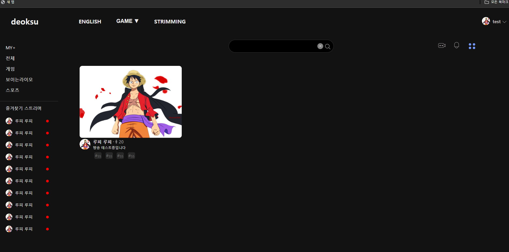
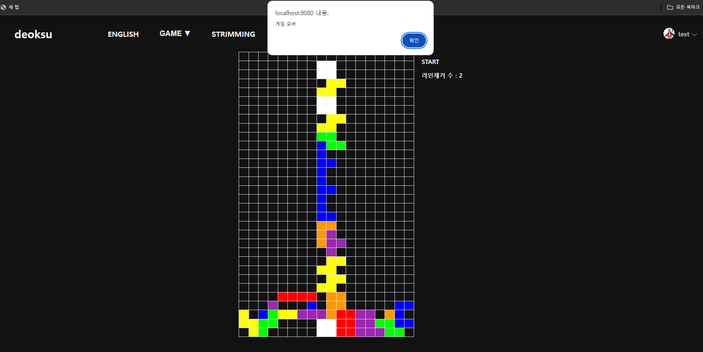

영어 단어장으로 사용(한글 – 영어 매칭 문제가 아닌, 사진 – 영어 매칭 문제)

local 환경에 있는 영상을 웹상에서 자막 포함 볼 수 있는 방법을 알아보기 위해 개발

소켓 활용하여 엣지와 크롬을 통해 채팅 기능 개발 및 테스트 확인
admin 또는 test 접속을 알리는 “admin님이 입장했습니다.” , “test님이 입장했습니다.” 메시지 표출
이후 몇 개 채팅 치면서 정상 동작 확인

영상 화면이 표출 및 1초마다 서버에 영상 보내기(ffmpeg로 영상 합치기 성공)

방송이 시작되면 방송 목록이 보이는 것을 확인
썸네일 클릭 시 방송으로 진입까지만 기능 개발
video 스트리밍까지는 아직 미완성

2명이서 테트리스 할 수 있도록 개발중
